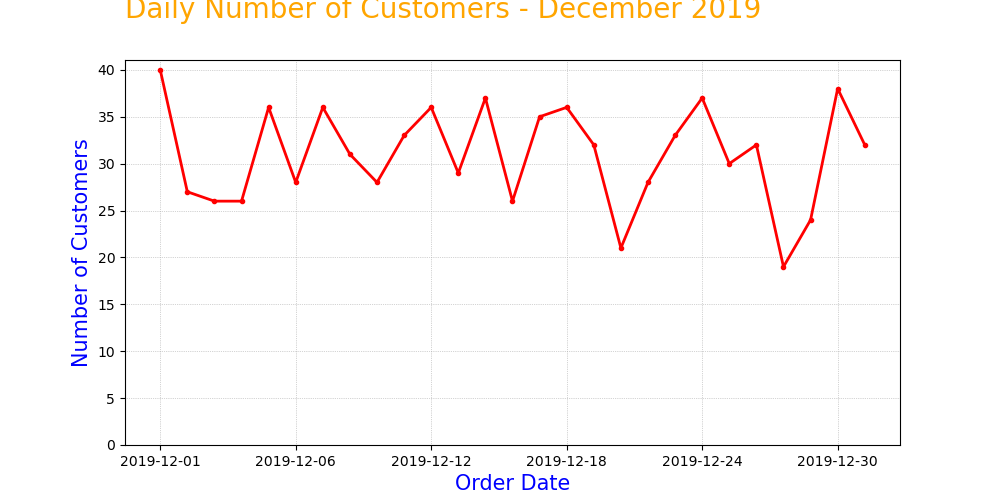

## Studi Kasus dari [DQLab Academy](https://dqlab.id): Daily number of customers on Desember 2019

Dengan menggunakan dataset pada link [ini](https://dqlab-dataset.s3-ap-southeast-1.amazonaws.com/retail_raw_reduced.csv), Saya membuat sebuah line chart dengan Matplotlib, yang menunjukkan jumlah pembeli harian (daily number of customers) selama bulan Desember 2019.

Beberapa spesifikasi yang harus diperhatikan:
- Ukuran figure adalah 10x5
- Sumbu-x adalah tanggal pembelian, dari tanggal 1 - 31 Desember 2019
- Sumbu-y adalah jumlah unique customers di tiap tanggal
- Title dan axis label harus ada, tulisan dan style-nya silakan disesuaikan sendiri

## Result

