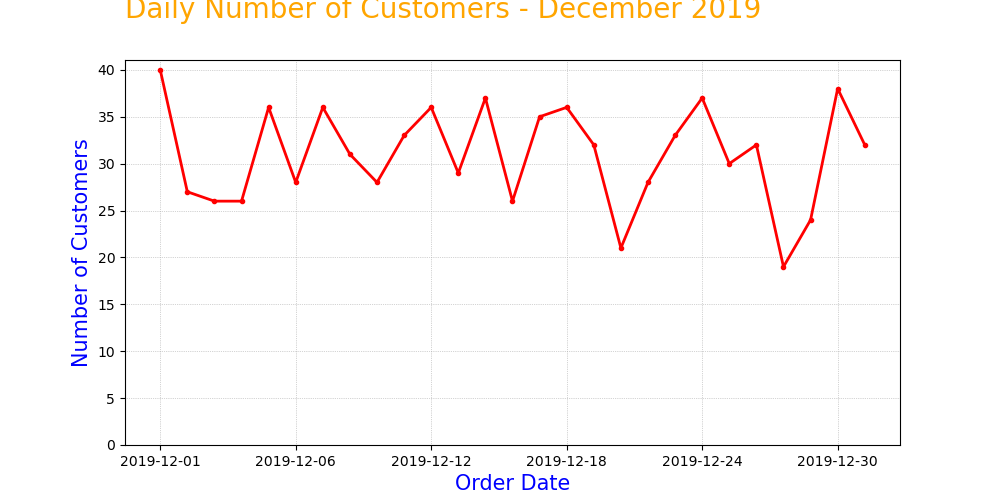
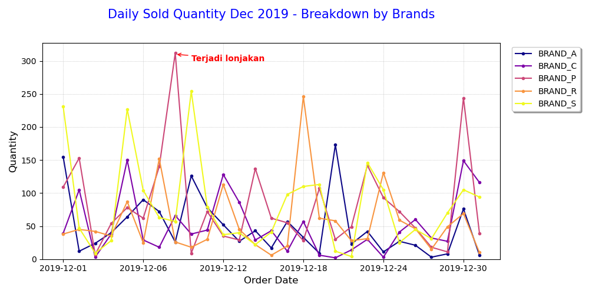
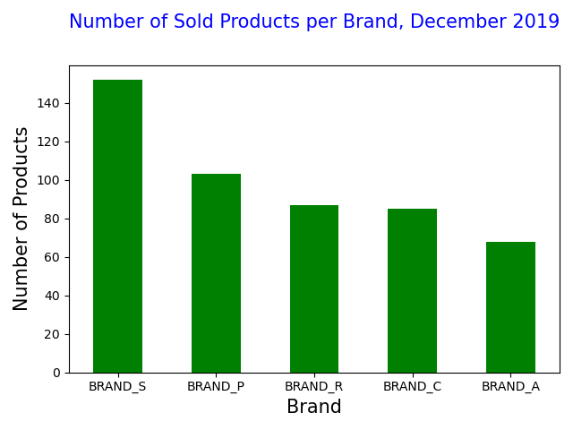
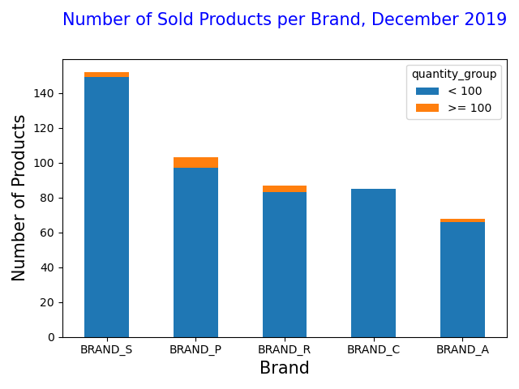
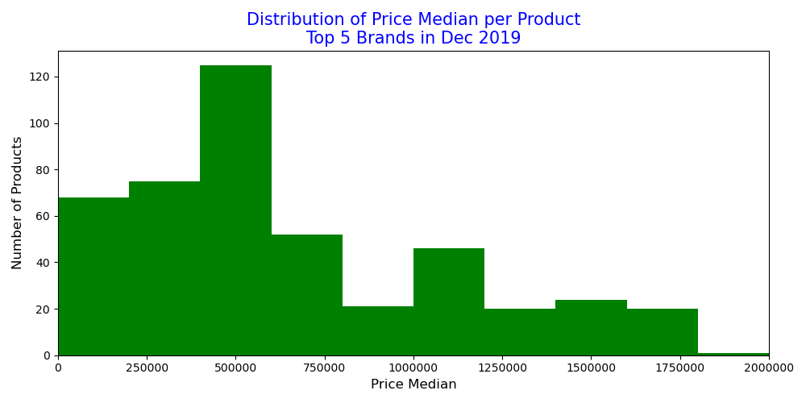
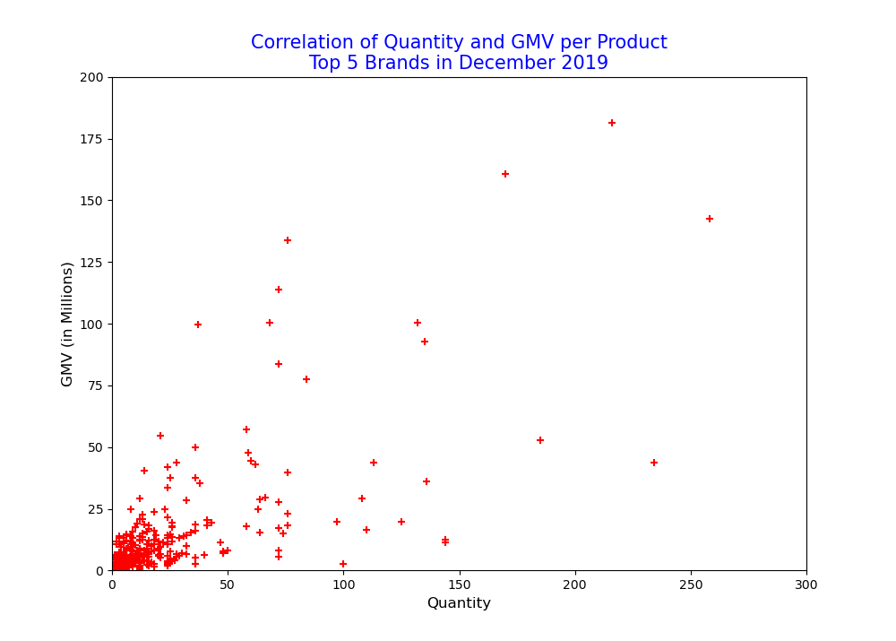
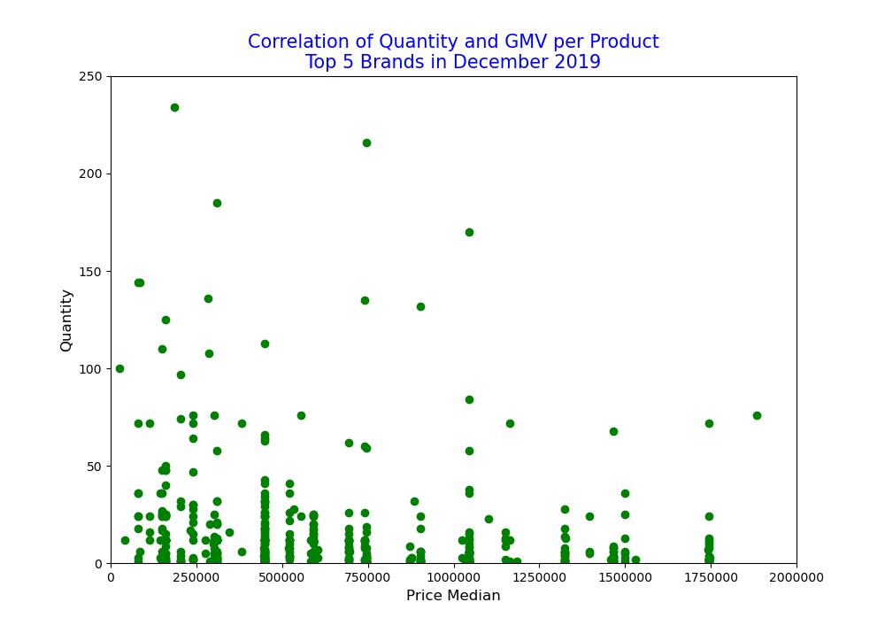

# Mini Project dari [DQLab Academy](https://dqlab.id)

Dengan menggunakan dataset pada link [ini](https://dqlab-dataset.s3-ap-southeast-1.amazonaws.com/retail_raw_reduced.csv. 

## Part 1

Sebuah line chart dengan Matplotlib, yang menunjukkan jumlah pembeli harian (daily number of customers) selama bulan Desember 2019.

Beberapa spesifikasi yang harus diperhatikan:
- Ukuran figure adalah 10x5
- Sumbu-x adalah tanggal pembelian, dari tanggal 1 - 31 Desember 2019
- Sumbu-y adalah jumlah unique customers di tiap tanggal
- Title dan axis label harus ada, tulisan dan style-nya silakan disesuaikan sendiri

### Result

## Part 2

Melakukan analisis untuk top brands di bulan Desember 2019. 

Beberapa hal yang perlu dilakukan:
- Case 1: Menentukan brand top 5
- Case 2: Multi-line chart daily quantity untuk brand top 5
- Case 3: Kuantitas penjualan brand top 5 selama Desember 2019
- Case 4: Penjulan produk diatas 100 dan dibawah 100 selama Desember 2019
- Case 5: Murah atau mahalkah harga produk brand top 5
- Case 6:   
  a. Korelasi quantity vs GMV   
  b. Korelasi median harga vs quantity
  
### Result

